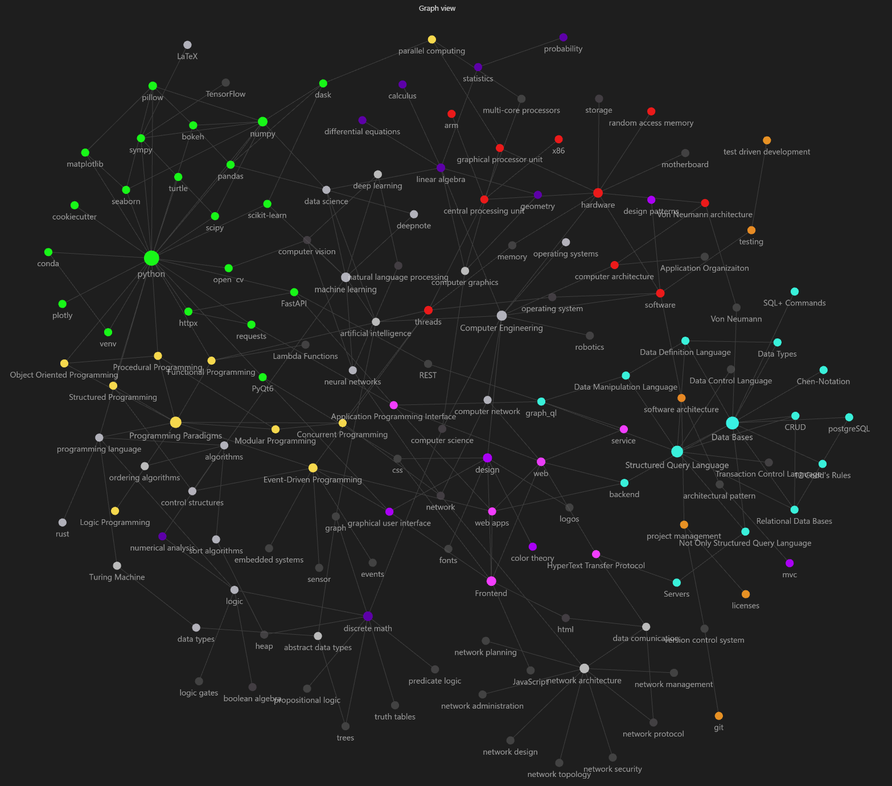

# Computer Engineering

This repository is a collection of concepts, algorithms, and data structures that I have been learning in my Computer Engineering degree.
I have tried to make the **code as simple as possible**, and I have tried to explain the concepts as best as I can.

I hope this repository can help you in your studies.

#### Note: This repository is still under construction, so it is not complete yet.
To see the complete list of topics & it's relations open the repository using a [Obsidian](https://obsidian.md/) graph viewer.



## Table of Contents
```
├───computer_architecture
├───data_bases
├───logic
│   └───algorithms
├───math
│   ├───linear_algebra
│   ├───numerical_analysis
├───programming
│   ├───paradigms
│   │   ├───declarative
│   │   └───imperative
│   └───python
│       ├───libraries
│       └───notebook
└───software_architecture
    ├───design
    │   └───patterns
    └───testing
```

#### [Complete list of topics](/resources/to_do.md) (I have not added all the content yet)

#### [License](LICENSE.md) (GNU General Public License v3.0)

