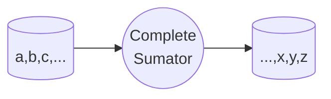

# Digital Systems

[[embedded system]]

# [6th Semester stuff](/schedule.md)
Everything is based based on HDL (Hardware Description Language) and VHDL (Very High Speed Integrated Circuit Hardware Description Language) is the most popular one.

- `mail`: jmatadamasg486@profesor.uaemex.mx
- `language`: [VHDL](https://en.wikipedia.org/wiki/VHDL)

- `books`:
    - Nelson, Victor, Digital Systems Design Using VHDL, Prentice Hall, 2002
    - Daniel Sibiorek, Sistemas Digitales, libro 6
        - gerarquia de sistemas digitales

### Combinatorial Logic
Is a logic circuit that has only one output for each input combination. The output is determined by the input values and the logic gates used in the circuit. The output is not dependent on the previous state of the circuit. The output is determined by the current input values and the logic gates used in the circuit. The output is not dependent on the previous state of the circuit.
### Sequential Logic
Is a logic circuit that has a memory element that stores the previous state of the circuit. The output is dependent on the previous state of the circuit. The output is determined by the current input values and the logic gates used in the circuit. The output is not dependent on the previous state of the circuit.

## Digital Logic
- 1 input D
- 2 inputs JK

CLC - combinational logic circuits
cls - combinational logic sistems

----
1 Development of Digital Systems (HDL)
- concepts of digital systems
- languages (VHDL, Verilog)

2 combinational logic synthesis
- combinational & sequential logic
- multiplexers & demultiplexers
- decoders & encoders
- magnitude comparators
- adders & subtractors
- shifters & counters
- signal propagation
- memory elements & memory devices (data storage)
- registers, flip-flops, latches

3 sequential logic synthesis
- state machines
- finite state machines
- Moore & Mealy machines
- state diagrams

4 asynchronous state machines
- pwm (pulse width modulation) & frequency modulation
- keyboard & mouse input
- graphic output
