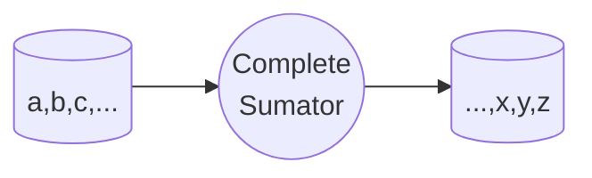

# Digital Systems

Is a system that **uses digital signals (0 or 1) to represent information**.

### Combinatorial Logic
Is a logic circuit that has only one output for each input combination. The output is determined by the input values and the logic gates used in the circuit. The output is not dependent on the previous state of the circuit. The output is determined by the current input values and the logic gates used in the circuit. The output is not dependent on the previous state of the circuit.

### Sequential Logic
Is a logic circuit that has a memory element that stores the previous state of the circuit. The output is dependent on the previous state of the circuit. The output is determined by the current input values and the logic gates used in the circuit. The output is not dependent on the previous state of the circuit.

## Digital Logic
- 1 input D
- 2 inputs JK

CLC - combinational logic circuits
cls - combinational logic systems
SLC - sequential logic circuits

# [6th Semester stuff](/schedule.md)
Evaluaiton:
- exams: 30%
- project & practices: 35%
- homework: 10%
- ordinary exam: 25%

`mail`: jmatadamasg486@profesor.uaemex.mx

`language`: [vhdl](/languages/vhdl.md)

`books`:
    - Nelson, Victor, Digital Systems Design Using VHDL, Prentice Hall, 2002
    - Daniel Sibiorek, Sistemas Digitales, libro 6 (gerarquia de sistemas digitales)

Everything is based based on HDL (Hardware Description Language) and VHDL (Very High Speed Integrated Circuit Hardware Description Language) is the most popular one.

----

1 Basic Concepts of Digital Systems
- Karnaugh maps
- Jerarchy Levels
- logic families
- design process

2, 7 Development environments and Design Tools
- HDL
- VHDL and Verilog
- Development boards
- Architecture

3 Combinaional Logic Synthesis
- Multiplexers and Demultiplexers
- Decoders and Encoders
- Magnitude Comparators
- Adders and Substractors
- number systems (and their conversion)

4 Flip-flops and Shift Registers (HDL)
- syntax
- latch & flip-flop
- d type flip-flop
- shift registers
- counters
- signal propagation (and priority)
- memory elements & memory devices (data storage)

5 Async State Machines
- moore & mealy machines
- synthesis of async systems of data transfer

6 Sync State Machines
- pwm (pulse width modulation) & frequency modulation
- keyboard & mouse input
- graphic output

7 Jerarchy Design
- block diagram (for global design)
- component design
- top-level program design
- pipelining

8 minimum system
- design of a minimum system
- design instruction set
- implementation en a pld (programmable logic device)

9 [embedded systems (8th semester)](/computer_architecture/embedded_systems/embedded%20system.md)
- microcontrollers
- hdl code generation and upload to the microcontroller
