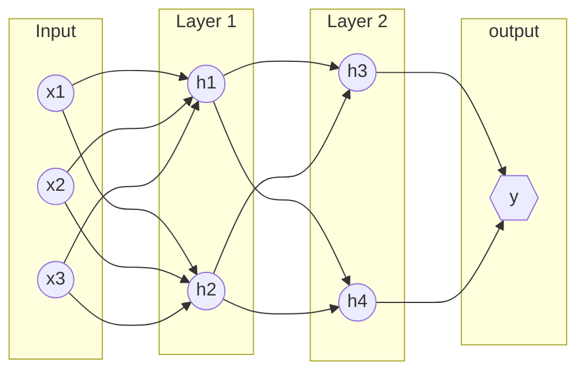

# [Deep Learning](https://en.wikipedia.org/wiki/Deep_learning)

Is a subfield of [[machine learning]] concerned with algorithms inspired by the structure and function of the brain called artificial [[neural network|neural networks]]. Learning can be supervised, semi-supervised or unsupervised.

Where `x` is an input variable that is multiplied by a weight `w` and added to a bias `b` to produce an output `h`. The output `h` is then passed through an **activation function `f`** to produce the final output `y`.

$$ h = f(w_1x_1 + w_2x_2 + w_3x_3 + b) $$

## Architecture

### Deep Feed-Forward
Use activation functions to introduce non-linearity into the model. The most common activation function is the [[rectified linear unit|ReLU]].

### Convolutional
Use a convolutional neural network to extract features from images. 

### Recurrent
Use a loop to allow information to persist.

### [Natural Language Processing](natural%20language%20processing.md) (NLTK)
Is a subfield of [[artificial intelligence]] concerned with the interactions between computers and human (natural) languages, in particular how to program computers to process and analyze large amounts of natural language data.

### [Computer Vision](/computer_vision/computer%20vision.md)
Is a subfield of [[artificial intelligence]] that deals with how computers can be made to gain high-level understanding from digital images or videos. From the perspective of engineering, it seeks to automate tasks that the human visual system can do.

## Optimization Algorithms
- sgd (stochastic gradient descent)
- momentum (momentum optimizer)
- nesterov (nesterov accelerated gradient)
- nag (nesterov accelerated gradient)
- adagrad (adaptive gradient)
- adadelta (adaptive delta)
- rmsprop (root mean square propagation)

- backpropagation (gradient descent) -> finds the minimum cost of a function
- forepropagation (forward propagation) -> finds the output of a function

- adam (adaptive moment estimation)
- adamax (adaptive moment estimation with infinity norm)
- nadam (nesterov adam)
- tfoptimizer (tensorflow optimizer)

## Activation Functions
- **sigmoid** $\rightarrow$ $f(x) = \frac{1}{1 + e^{-x}}$
  Used in the output layer of a **binary classification** problem.

- **tanh** $\rightarrow$ $f(x) = \frac{e^x - e^{-x}}{e^x + e^{-x}}$
  Used in the output layer of a binary classification problem.

- **reLU** (Rectified Linear Unit) $\rightarrow$ $f(x) = \begin{cases} x & x > 0 \\ 0 & x \leq 0 \end{cases}$
  Used in hidden layers of a neural network.

- **Leaky ReLU** $\rightarrow$ $f(x) = \begin{cases} x & x > 0 \\ \alpha x & x \leq 0 \end{cases}$
  Used in hidden layers of a neural network.

- elu $\rightarrow$ $f(x) = \begin{cases} x & x > 0 \\ \alpha(e^x - 1) & x \leq 0 \end{cases}$
  Used in hidden layers of a neural network.

- selu $\rightarrow$ $f(x) = \begin{cases} \lambda x & x > 0 \\ \lambda \alpha(e^x - 1) & x \leq 0 \end{cases}$
  Used in hidden layers of a neural network.

[[keras]]

