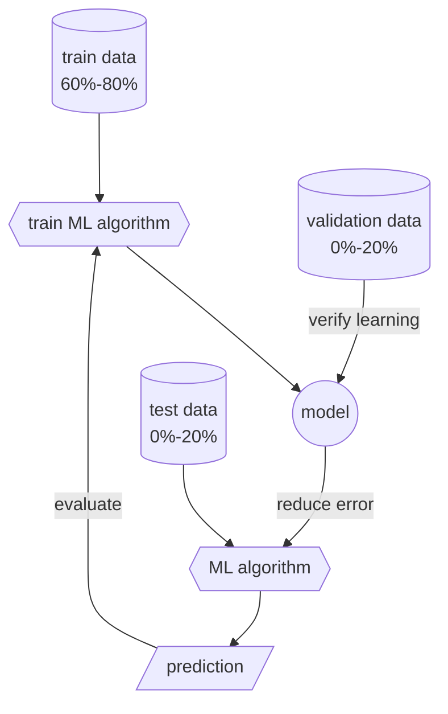

# Machine Learning

Is a field of inquiry devoted to understanding and building methods that $learn$, that is, methods that leverage data to improve performance on some set of tasks. It is seen as a part of [[artificial intelligence]].

Machine learning [[algorithms]] **build a model based on sample data**, known as **training data**, in order to make predictions or decisions without being explicitly programmed to do so, these  [[algorithms]] are used in a wide variety of applications, such as in medicine, email filtering, speech recognition, agriculture, and [[computer vision]], where it is difficult or unfeasible to develop conventional algorithms to perform the needed tasks.

Some implementations of machine learning use data and [[neural network]] in a way that mimics the working of a **biological brain**. In its application across business problems, machine learning is also referred to as **predictive analytics**.

Used in [[artificial intelligence]] to train the AI model that can solve a determinated problem.
1. Input the train data
2. Train the [[algorithms|algorithm]] to solve that problem
3. Get the model & try to use it to **predict** some outputs using different data.
4. Evaulate the model to see if it's viavle to use it & improve it (step 2).

## Objectives
The main objective of a machine learning algorithm is to **minimize the error** while **maximizing the accuracy** (*real positive + real negative*) of the model.
- **Decision Process**: A process that takes an input and produces an output trying to **predict a discrete value**. `for example, given a picture of a fruit, classify it as an apple or an orange`
- **Error Function**: A function that measures how good the model is. The goal is to minimize this function.
- **Upgrade Rule**: A rule that tells how to upgrade the model to make it better.

| | Real positive | Real negative |
| --- | --- | --- |
| **Predicted positive** | True positive | False positive |
| **Predicted negative** | False negative | True negative |

## Overfitting
Is a problem where a model performs worse on new data than on their training data. This is caused by the model learning the training data too well.

Using the **dropout** technique, a **random subset of the neurons are ignored during training**. This forces the network to learn redundant representations of the data. This technique is used to **prevent overfitting**.

## Types of Machine Learning

### Supervised Learning
The algorithm **learns from labeled data**.
- **Classification** predict a discrete value.
    - **Binary classification** 
    - **Multiclass classification**
    - **Multilabel classification**
    - **Imbalanced classification**
    - **Decision tree** is a flowchart-like structure in which each internal node represents a "test" on an attribute, each branch represents the outcome of the test, and each leaf node represents a class label (decision taken after computing all attributes). The paths from root to leaf represent classification rules.
- **Regression** predict a continuous value.
    - **Linear regression** predict a line that best **fits the data**.
    - **Logistic regression** predict a line that **splits the data into two classes**.

### Unsupervised Learning
The algorithm **learns from unlabeled data**.
- **Clustering** Find hidden patterns. Mostly used for **data segmentation**.
    - **[K-means](https://pegadro.github.io/kmeans-visualizer/)** Separates the data into k clusters.  
    - **C-means** This algorithm is similar to *K-means*, but it uses a **fuzzy logic approach**.
- **Association** find associations between variables.
    - **Apriori** finds associations between variables using the Apriori algorithm (frequent itemsets).
    - **EM** find associations between variables using the EM algorithm.
- **Dimensionality reduction** reduce the number of variables.
    - **PCA** (Principal Component Analysis) finds the principal components of the data using the PCA algorithm.
    - **SVD** (Singular Value Decomposition) finds the principal components of the data using the SVD algorithm.

### Reinforcement Learning
The algorithm **learns from the interaction with the environment**.
- **Control** find the best action to take.
    - **Q-learning** find the best action to take using the Q-learning algorithm.
    - **SARSA** find the best action to take using the SARSA algorithm.
    - **Policy gradient**find the best action to take using the policy gradient algorithm.
- **Exploration**find the best action to take in an unknown environment.
    - **UCB** (Upper Confidence Bound) UCB algorithm.
    - **Thompson sampling** algorithm.
    - **Bayesian optimization** algorithm.

| Criteria | Supervised Learning | Unsupervised Learning | Reinforcement Learning |
| --- | --- | --- | --- |
| **Data** | Labeled | Unlabeled | Unlabeled |
| **Algorithms** | Linear and Logistic Regression | K-means, C-Means, Apriori, EM | Q-learning, SARSA, Policy gradient |
| **AIM** | Predict the output from the input | Find hidden patterns | Find the best action to take |
| **Examples** | Spam filter, Image recognition, Predicting the price of a house | Market segmentation, Social network analysis, Anomaly detection | Robot control, Game playing, Resource allocation |

### [Deep Learning](deep%20learning.md)
Is a subset of machine learning that has networks capable of **learning unsupervised from data that is unstructured or unlabeled**. Deep learning is part of a broader family of machine learning methods based on learning data representations, as opposed to task-specific algorithms.

----

## References
- [Introduction to Machine Learning](https://platzi.com/cursos/machine-learning/)

