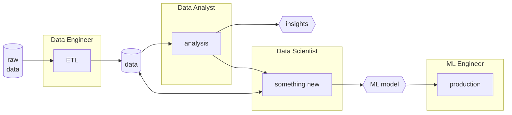

# [Data Science](https://www.kaggle.com/datasets/timoboz/data-science-cheat-sheets)

Is an interdisciplinary academic field that **uses [[statistics]], [[computer science]], scientific methods, processes, [[algorithms]], systems and [[operations research]]** to $extract$ or $extrapolate$ knowledge and insights from noisy, structured and unstructured data.
Is the process in which we use data to interpolate & get more usefull information. to get more information from data.
The **data science** uses [[artificial intelligence]] as a tool to try to make predictions.

## [[big data|Big Data]]
Concept use when we've big volumes of data, very varied and fast, so much that it's difficult to process them with traditional methods.
- **Volume** name ‘Big Data’ itself is related to a size which is enormous. Is a huge amount of data.
- **Velocity:** Velocity refers to the high speed of accumulation of data. In Big Data velocity data flows in from sources like machines, networks, social media, mobile phones etc.
- **Variety** It refers to nature of data that is structured, semi-structured and unstructured data.
-   It also refers to heterogeneous sources. **Structured data** ,**Semi- Structured data** ,**Unstructured data**
- **Veracity** It refers to inconsistencies and uncertainty in data, that is data which is available can sometimes get messy and quality and accuracy are difficult to control.
- **Value:** After having the 4 V’s into account there comes one more V which stands for Value!. The bulk of Data having no Value is of no good to the company, unless you turn it into something useful.

## [Data Engineer](data%20engineering.md)
Also known as a data architect, is the one who **stores, processes and manages the data**. Cleans, organizes and stores data in a way that is easy to access and use. Is also the one who creates the data **pipelines**, the ones that connect the data from the source to the [data scientist](data%20scientist.md).

## [Data Analyst](data%20analysis.md)
Is a subset of [[data science]] that focuses on **analyzing data to answer questions or test [[statistics|hypotheses]]** and to **extract insights** from data, **cleaning, transforming, and modeling data to discover useful information** suggesting conclusions, and supporting decision-making.

1. Ask a question (or a few questions)
2. Prepare data ([[big data|get data]])
3. Process data (get insights)
4. [[computer graphics|Visualize results]]
5. Share results

## [Data Scientist](data%20scientist.md)
Is the one who **uses the data to create new knowledge**. Is the one who **creates the models** that will be used by the [[machine learning]].

## [Machine Learning Engineer](./artificial_intelligence/machine%20learning.md#machine-learning-engineer)
Is the one who **creates, trains and deploys the models**. Is the one who **creates the [[application programming interface|API]]** that will be used by the [[data scientist]].

----
## References
- https://platzi.com/cursos/ingenieria-datos/
- [Análisis de Negocios para Ciencia de Datos](https://platzi.com/cursos/negocios-data-science/?school=_escuela_escuela-datos_)
- [Ética y Manejo de Datos para Data Science e Inteligencia Artificial](https://platzi.com/cursos/etica-ia/?school=_escuela_escuela-datos_)
