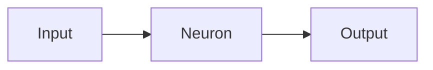

# [[neurons|Neural]] [[network|Network]]

Is a [[network]] of [[neurons]] (is a mathematical function that takes in a set of inputs and produces an output).
The output of one neuron can be used as an input to another neuron. The edges can have weights that are used to modify the inputs to the neuron. The weights can be adjusted to improve the accuracy of the network.

### What is the difference between a neural network and a deep neural network?
A neural network is a type of [[machine learning#$Supervised Learning$|supervised learning]] where the algorithm learns to predict a continuous value. A deep neural network is a type of supervised learning where the algorithm learns to predict a continuous value. A deep neural network is a neural network with multiple hidden layers.

### What is the difference between a convolutional neural network and a recurrent neural network?
A convolutional neural network is a type of supervised learning where the algorithm learns to predict a continuous value. A recurrent neural network is a type of supervised learning where the algorithm learns to predict a continuous value. A recurrent neural network is a neural network with a feedback loop.

### What is the difference between a generative adversarial network and a reinforcement learning algorithm?
A generative adversarial network is a type of unsupervised learning where the algorithm learns to predict a continuous value. A reinforcement learning algorithm is a type of unsupervised learning where the algorithm learns to predict a continuous value. A reinforcement learning algorithm is a neural network with a feedback loop.
