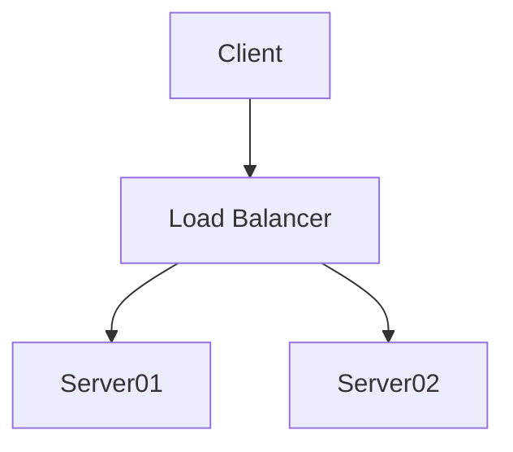

# [Mermaid](https://mermaidjs.github.io/)

Mermaid is a simple $markdown-like$ [[script language]] for **generating charts and [[flow diagram|diagrams]] from text via [[javascript]]**. It's great for quickly sketching out diagrams for documentation.

## Usage

### References
- [usage example (video)](https://www.youtube.com/watch?v=Tsu02d6Qti0)
- [Mermaid Documentation](https://mermaidjs.github.io/)
- [Mermaid Live Editor](https://mermaidjs.github.io/mermaid-live-editor/)

