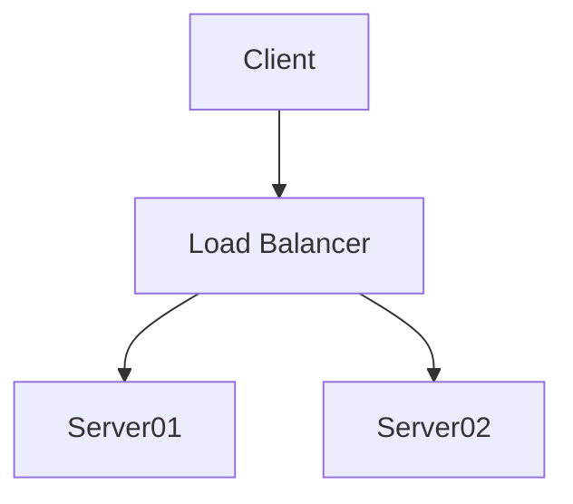
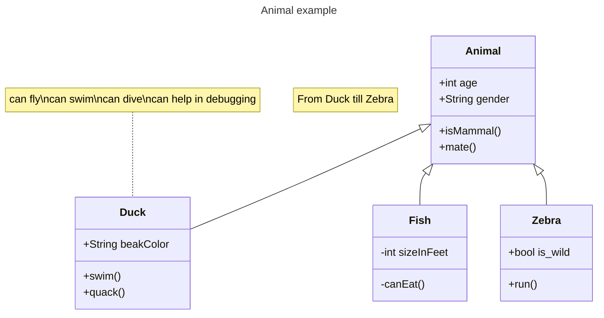

# [Mermaid](https://mermaidjs.github.io/)

Mermaid is a simple $markdown-like$ [[script language]] for **generating charts and [[uml|diagrams]] from text via [[javascript]]**. It's great for quickly sketching out diagrams for documentation.

## Usage
[[flow diagram]]

### [class diagram](https://mermaid.js.org/syntax/classDiagram.html)
[[class diagram]]
Is a type of static structure diagram that describes the structure of a system by showing the system's classes, their attributes, operations (or methods), and the relationships among objects.

### References
- [usage example (video)](https://www.youtube.com/watch?v=Tsu02d6Qti0)
- [Mermaid Documentation](https://mermaidjs.github.io/)
- [Mermaid Live Editor](https://mermaidjs.github.io/mermaid-live-editor/)

