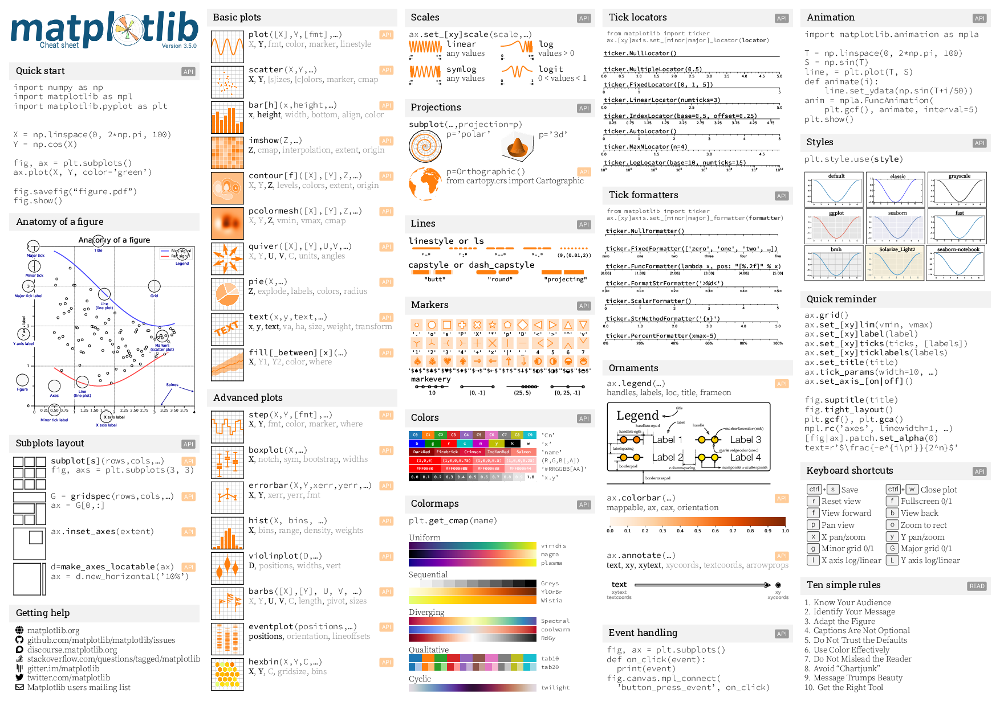
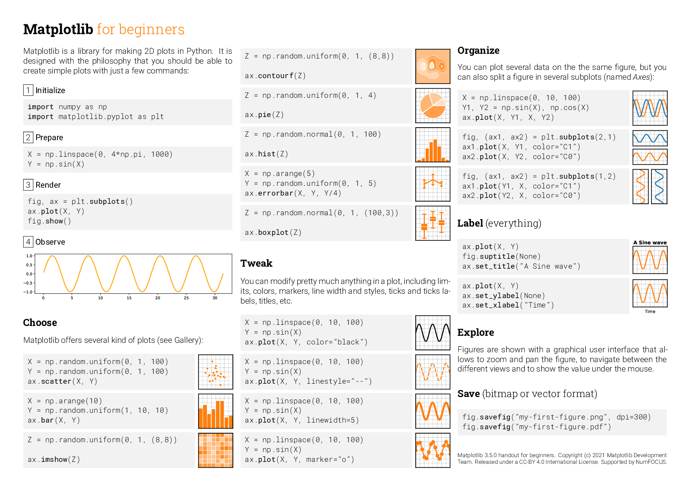
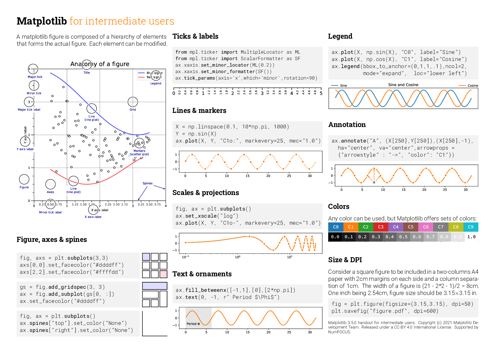
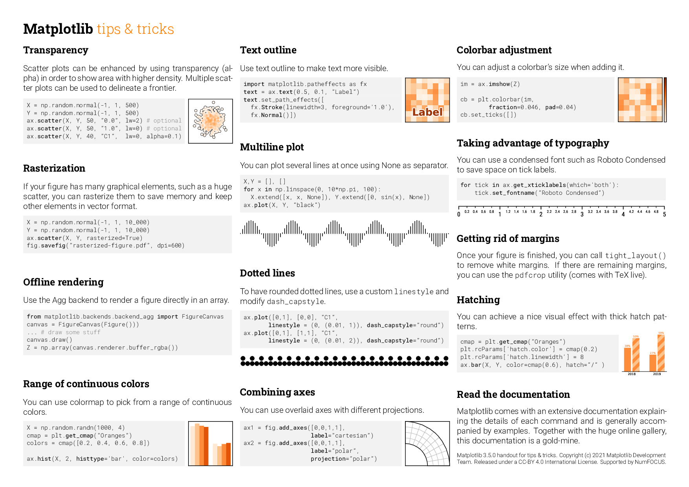
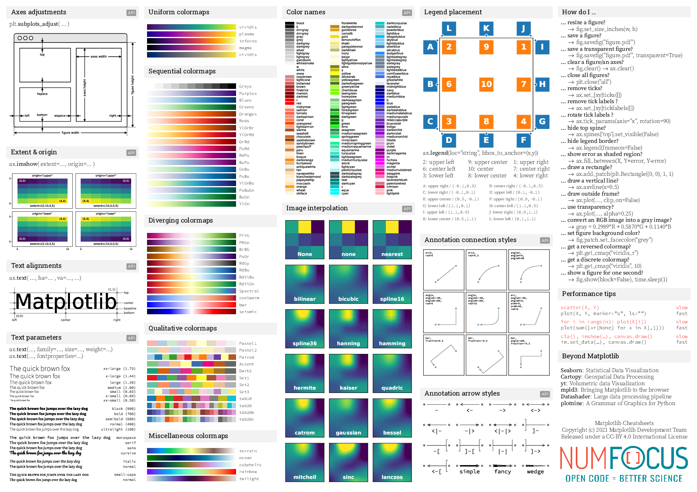

# [matplotlib](https://matplotlib.org/)
Is a [[python]] library for **creating charts and graphs**. It provides high-performance, easy-to-use data structures and data analysis tools.


## Installation
```bash
pip install matplotlib
```

## Usage
```python
import matplotlib  # This is the main library
import matplotlib.pyplot as plt  # This module allows you to create charts and graphs easily

import matplotlib.patches as mpatches  # This module allows you to create patches (shapes) for your charts
import matplotlib.lines as mlines  # This module allows you to create lines for your charts
import matplotlib.image as mpimg  # This module allows you to import images for your charts
import matplotlib.text as mtext  # This module allows you to create text for your charts
import matplotlib.collections as mcollections  # This module allows you to create collections for your charts
import matplotlib.transforms as mtransforms  # This module allows you to create transformations for your charts
import matplotlib.ticker as mticker  # This module allows you to create tickers for your charts
import matplotlib.backend_bases as mbackend_bases  # This module allows you to create backend bases for your charts
import matplotlib.artist as martist  # This module allows you to create artists for your charts
import matplotlib.cbook as mcbook  # This module allows you to create books for your charts
import matplotlib.style as mstyle  # This module allows you to create styles for your charts
import matplotlib.animation as manimation  # This module allows you to create animations for your charts
import matplotlib.font_manager as mfont_manager  # This module allows you to create fonts for your charts
import matplotlib.colors as mcolors  # This module allows you to create colors for your charts
import matplotlib.cm as cm  # This module allows you to create color maps for your charts
import matplotlib.colorbar as mcolorbar  # This module allows you to create color bars for your charts
import matplotlib.widgets as mwidgets  # This module allows you to create widgets for your charts
import matplotlib.projections as mprojections  # This module allows you to create projections for your charts

```








----
## Resources
- [tutorial](https://matplotlib.org/stable/tutorials/index.html)
- [api](https://matplotlib.org/stable/api/index)
