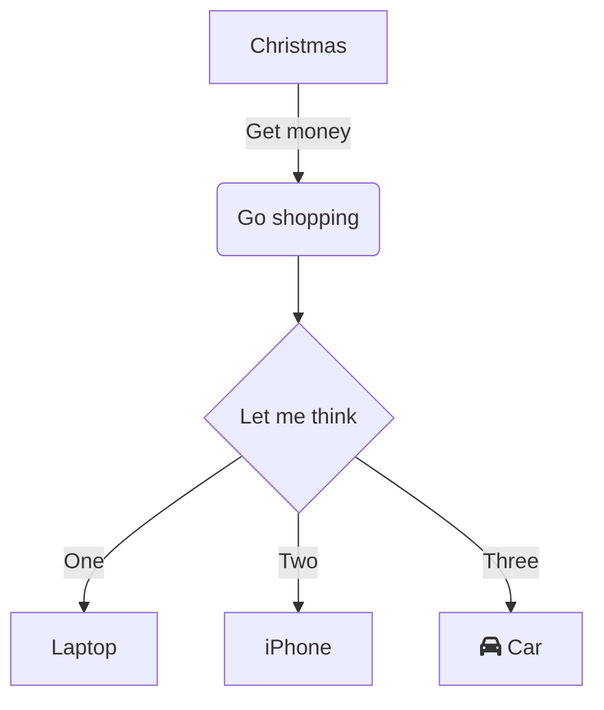

# Algorithms

Is a finite list of instructions that describe a process that recives `inputs`, executes and return `outputs`. An algorithm can't be ambigous.

### [Complexity](https://devopedia.org/algorithmic-complexity)

| $class$ | n=10 | n=100 | n=1000 | n=10000 | n=100000 | n=1000000 |
|----|----|----|----|----|----|----|
| $O(1)$ | $1$ | $1$ | $1$ | $1$ | $1$ | $1$ |
| $O(log(n))$ | $3$ | $6$ | $10$ | $13$ | $17$ | $20$ |
| $O(n)$ | $10$ | $100$ | $1000$ | $1\times10^4$ | $1\times10^5$ | $1\times10^6$ |
| $O(n\times log(n))$ | $30$ | $600$ | $1x10^4$ | $13\times10^4$ | $17\times10^5$ | $2\times10^7$ |
| $O(n^2)$ | $100$ | $1\times10^4$ | $1\times10^6$ | $1\times10^8$ | $1\times10^{10}$ | $1\times10^{12}$ |

![[complexity.png]]

### [Search Algorithms](/logic/search_algorithms.ipynb)
- linear search
- binary search
- jump search
- interpolation search
- exponential search
- fibonacci search
- ternary search

### [Sort Algorithms](/logic/sort_algorithms.ipynb)
- bubble sort
- insertion sort
- quick sort
- bubble sort
- heap sort
- shell sort
- radix sort

### [[flow diagram|Flow Diagram]]
Are a way to represent algorithms in a visual way.

