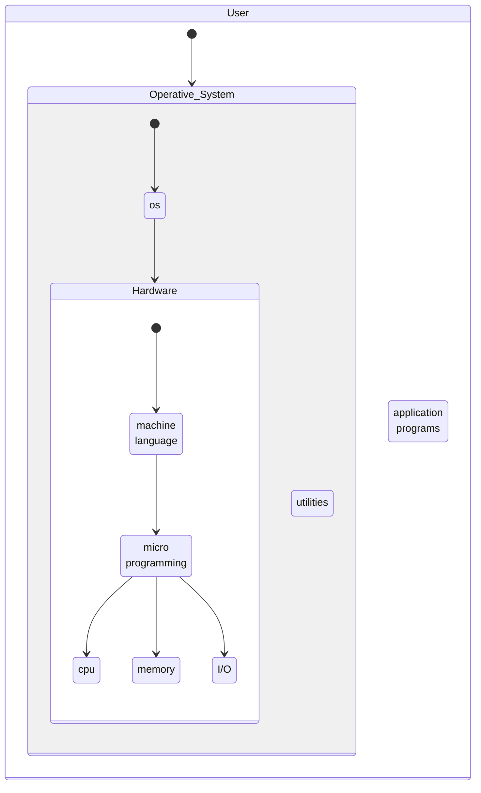

# [Operating System](https://en.wikipedia.org/wiki/Operating_system)

Can be defined as an **interface between user and the hardware**. It provides an environment to the user so that, the user can perform its task in convenient and efficient way. It **manages** computer [hardware](/computer_architecture/hardware/hardware.md), [software resources](/software_architecture/software%20resources.md), and provides common services for computer programs.

The purpose of an operating system is to provide an environment in which a user can execute programs in a convenient and efficient manner.



The basic functions of an operating system are:
- **Booting**: Manages the startup of a device.
- **Memory management**: Coordinates computer applications and allocates space to different programs installed in the computer.
- **Drive/disk management**: Manages computer drives and divides disks.
- **I/O control**: Enables you to allow or block access to devices.
- **Loading and execution**: Starts and executes a program (manage the $process$).
    - **task manager**  
        - time and space used by each process
        - process communication between memory & files (codification)
        - process table (PID, name, memory_address, files, etc)
        - address space (where in begins:finish on memory)
        - irreversible block (processes interrupt each other)
- **(opt) Security**: Protects your data from cyberattacks.
- **(opt) User Interface**: Allow users to enter and receive information.
`daemon`: is a program that runs in the background and performs a specific task (not directly accessible to the user).

- [os](https://www.tutorialspoint.com/operating_system/os_overview.htm)
- [process](https://www.tutorialspoint.com/operating_system/os_processes.htm)

## Types

### maiframe
Is a large computer system that is **used by many users at the same time**. It is used for large-scale data processing and is capable of handling thousands of transactions per second. It is used in large organizations such as banks, insurance companies, and government agencies. It is also used in large-scale scientific and engineering applications.

### Server
Is a type of operating system that is **used on a server**. It is used in large organizations such as banks, insurance companies, and government agencies. It is also used in large-scale scientific and engineering applications.

### Integrated
Is any device that has a computer inside it. It is used to perform a specific task. This category includes the [[embedded system|embedded systems]] and [[mobile device|mobile devices]] and it's probably the **most common type of operating system**.
- mobile phone, digital camera, video game console, etc
- washing machine, refrigerator, etc

### Real-Time
Provide support to real-time systems that require observance of strict time requirements. The **response time between input, processing and response is tiny**, which is beneficial for processes that are highly sensitive and need high precision.
- medical robotics (surgery)
- military systems
- air traffic control
- nuclear power plants

### Time-Sharing or Multi-Tasking
Also known as a multitasking OS, works by allocating time to a particular task and switching between tasks frequently. Unlike the batch system, the time-sharing system allows users to complete their work in the system simultaneously. It **allows many users** to be distributed **across various terminals** to **minimize response time**.

### [[distributed systems|Distributed Systems (DOS)]]
Distributed systems **use many central processors to serve multiple real-time applications** and users. As a result, **data processing jobs are distributed between the processors**, so it connects multiple computers via a single communication channel. Furthermore, each of these systems has its own processor and memory. Additionally, these CPUs communicate via high-speed buses or telephone lines. Individual systems that communicate via a single channel are regarded as a single entity. They're also known as loosely coupled systems.

#### Types:
- `client-server` (client request server)
- `peer-to-peer` (client request client)
- `middleware` (enable interoperation between different systems)
- `cloud` (client request server)
    - `tree-tier` (client request server request server)
    - `n-tier` (client request server request server request server)

#### Features
- **Openness**: It means that the system's services are freely displayed through interfaces. Furthermore, these interfaces only give the service syntax. For example, the type of function, its return type, parameters, and so on. Interface Definition Languages are used to create these interfaces (IDL).
- **Scalability**: It refers to the fact that the system's efficiency should not vary as new nodes are added to the system. Furthermore, the performance of a system with 100 nodes should be the same as that of a system with 1000 nodes.
- **Resource Sharing**: Its most essential feature is that it allows users to share resources. They can also share resources in a secure and controlled manner. Printers, files, data, storage, web pages, etc., are examples of shared resources.
- **Flexibility**: A DOS's flexibility is enhanced by modular qualities and delivers a more advanced range of high-level services. The kernel/ microkernel's quality and completeness simplify the implementation of such services.
- **Transparency**: It is the most important feature of the distributed operating system. The primary purpose of a distributed operating system is to hide the fact that resources are shared. Transparency also implies that the user should be unaware that the resources he is accessing are shared. Furthermore, the system should be a separate independent unit for the user.
- **Heterogeneity**: The components of distributed systems may differ and vary in operating systems, networks, programming languages, computer hardware, and implementations by different developers.
- **Fault Tolerance**: Fault tolerance is that process in which user may continue their work if the software or hardware fails.

#### Advantages
1. It may share all resources (CPU, disk, network interface, nodes, computers, and so on) from one site to another, increasing data availability across the entire system.
2. It reduces the probability of data corruption because all data is replicated across all sites; if one site fails, the user can access data from another operational site.
3. The entire system operates independently of one another, and as a result, if one site crashes, the entire system does not halt.
4. It increases the speed of data exchange from one site to another site.
5. It is an open system since it may be accessed from both local and remote locations.
6. It helps in the reduction of data processing time.
7. Most distributed systems are made up of several nodes that interact to make them fault-tolerant. If a single machine fails, the system remains operational.

#### Disadvantages
1. The system must decide which jobs must be executed when they must be executed, and where they must be executed. A scheduler has limitations, which can lead to underutilized hardware and unpredictable runtimes.
2. It is hard to implement adequate security in DOS since the nodes and connections must be secured.
3. The database connected to a DOS is relatively complicated and hard to manage in contrast to a single-user system.
4. The underlying software is extremely complex and is not understood very well compared to other systems.
5. The more widely distributed a system is, the more communication latency can be expected. As a result, teams and developers must choose between availability, consistency, and latency.
6. These systems aren't widely available because they're thought to be too expensive.
7. Gathering, processing, presenting, and monitoring hardware use metrics for big clusters can be a real issue.


# [6th Semester stuff](/schedule.md)
- languages: `C` or `Java`


Evaluation
- 25% HW one/week
- 15% exam x3
- 15% project x2
    - one person
    - team (two people)

80% attendance < ord

60% attendance < extra

60% attendance > ets

`Book`: [Distributed and Modern Operative Systems, by Andrew S. Tanenbaum](../../UAEMex/5%C2%B0%20Semestre/Sistemas%20Operativos/Modern%20Operating%20Systems%2C%20Andrew%20S.%20Tanenbaum.pdf)

----
1 Basic Computer Organization and Architecture
- [Computer Organization and Design: The Hardware/Software Interface](https://www.amazon.com/Computer-Organization-Design-Hardware-Software/dp/0124077269)
- concepts of computer organization and architecture
- types of operating systems

2 Communication between processes
- process and sub-processes
- inter-process communication
- message passing

3 memory management
- virtual memory
- memory allocation

4 file management
- file system (files and directories)
- file system structure

5 distributed systems
- architecture of distributed systems
- remote procedure calls
- sockets
- pipes

6 synchronization
- shared memory
- message passing
- signals
- semaphores

----

- `DIR CONCEPT`: Manage files on the [dir levels](/operating_systems/linux.md#file-system-hierarchy-standard-fhs)

- security (unix-like dir) `-chmod 777` <-
    - rwx (9 bits security)
        - ownwer
        - group
        - everyone

```bash
├───parent/  # 700 (closed)
    ├───test_dir/  # 777 (open) so is accesible (vwx)
    └───dir_n/  # 700 (v--)

# --- (0) no permission
# --x (1) execute
# -w- (2) write
# r-- (4) read
```

### kernel
Is the core of the operating system. It is responsible for the allocation of resources to the various software components of the system. It is also responsible for the management of the various hardware components of the system.
### shell
Is an interface that allows users to interact with the operating system. It is a command-line interface that allows users to enter commands and receive information.