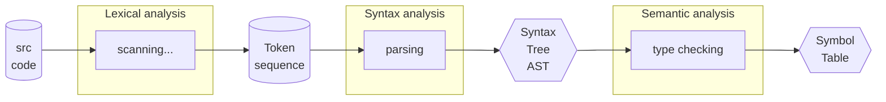

# [Compiler](https://en.wikipedia.org/wiki/Compiler)

Is a [[software]] that transforms **source code** written in a [[programming language]] (**source language**) into another computer language (**target language**), with the latter often having a binary form known as object code. The most common reason for converting source code is to create an executable program.

A compiler is usually divided into several phases, each of which transforms the program in some way.

### Lexical analysis `finite automata`
Is the process of **converting a sequence of characters into a sequence of tokens** (strings with an identified *meaning*).

### Syntax analysis (parsing) `LL(1) parser`
Is the process of **analysing a string of symbols**, conforming to the rules of a formal grammar, parsing is generally understood as determining the syntactic structure of a string of symbols.

### Semantic analysis (type checking) `LL(1) parser`
Is the process of **analyzing the meaning of a sequence of tokens**, usually in the context of a programming language. The goal is to detect and reject programs that contain **statements with meaningless or incorrect combinations of tokens**.

`LL(1) parser` == **recursive descent parser**.

# [6th Semester stuff](/schedule.md)
-> [regular expressions](/programming/regular%20expressions.md)
-> 

Evaluation (2 exams, 1 project, # homework):
- 50% exam (wed march 29th, wed june 7th)
- 40% project (compiler using [rust](/languages/rust/rust.md))
- 10% homeworks

the **project is a requirement for the exam**
- project 1 (map a web page (tree) to a json file) **NO REGEX OR XPATH**
- project 2 (compiler)

`Book`: Compilers: Principles, Techniques, and Tools, 2nd Edition, Alfred V. Aho, Monica S. Lam, Ravi Sethi, Jeffrey D. Ullman
